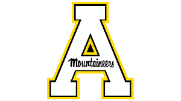

##River E. Pyle
-----
######Boone, North Carolina, USA, 28607
######pylere@appstate.edu
Enviornmental Risk Assessment & Consulting: Boone, North Carolina, USA
##Summary

<html>
<h1 style="font-family:timesnewroman;font-size:110%">
Sustainable developement consulting with focused research in water quality and agricultural systems.
</h1>
</h1>

##Education

* **B.A. Sustainable Developement - Appalachian State University - 2022** Community Regional & Global Development

* **GIS Cerificate - Appalachian State University - 2022**

##Work Expirience
* **Old North State Building Company** - (828) 623-0009 - General Contractor (**2015 - 2017**)

* **Diamondback 4x4** - (828) 581-0335, Swannnaoa, NC - Automotive Technician (**2016**)
* **Lake Eden Arts Festival (LEAF)** - (828) 686-8742, Black Mountain, NC - Production and Sound Engineering (**2013 - Present**)

* **Sugar Mountain Resort Inc.** - (828) 898-4521, Sugar Mountain, NC - Lift Operations (**2018**)

* **Appalachian Ski Mountain** - (828) 295-7828, Blowing Rock, NC - Rental Department (**2018 - 2019**)

* **French Swiss Ski College** - (828) 295 - 9311, Blowing Rock, NC - Snowboard Instructor (**2019 - Present**)

-----
